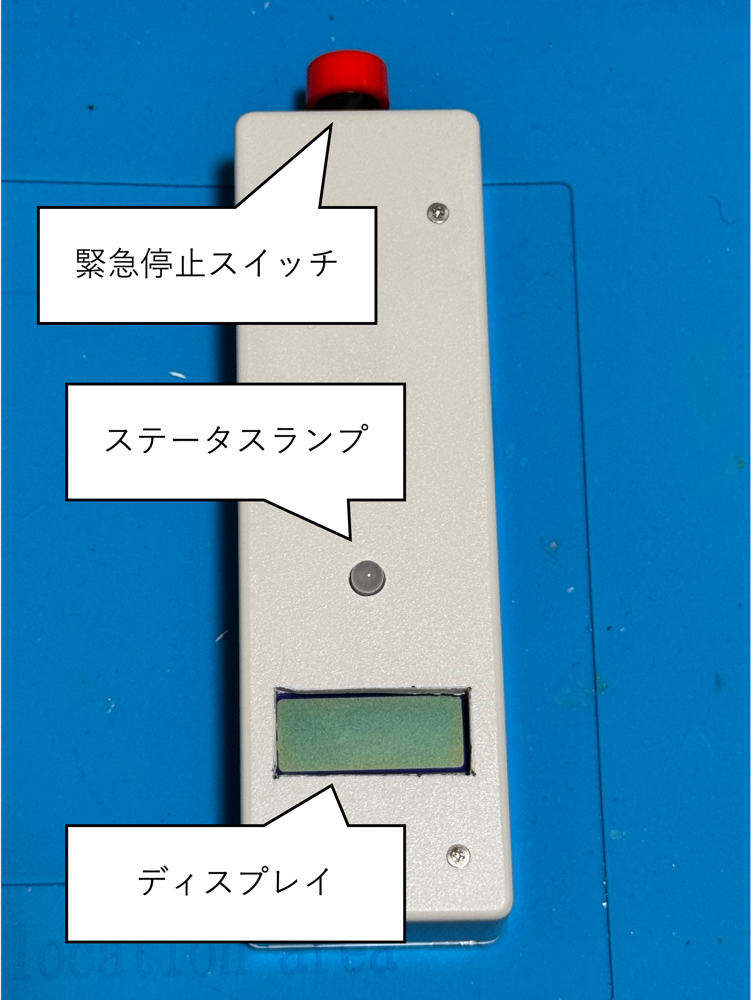
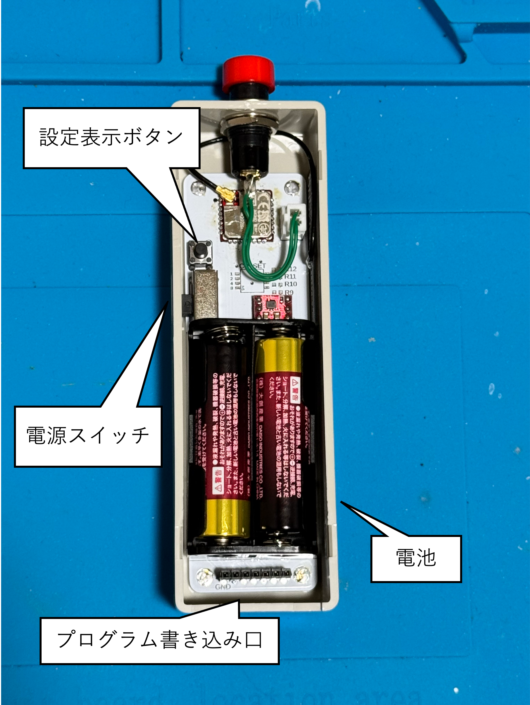
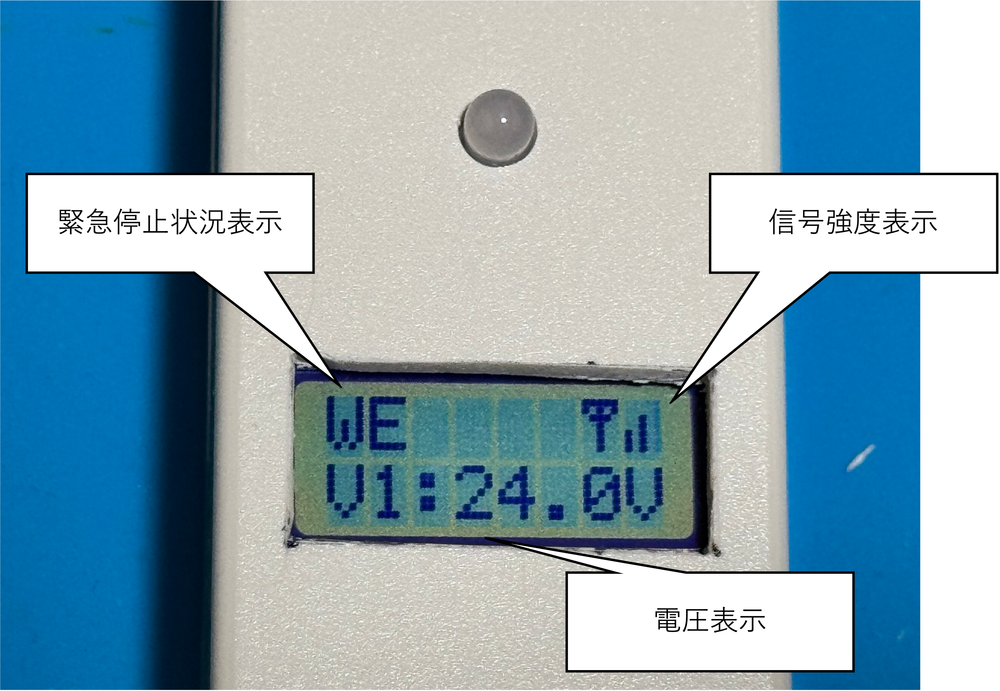

## Wireless_EM_Switch
[専用基板](https://github.com/KimuraTomohiro/PowerBoard2025)を制御する無線スイッチの公開データです。
本体は[こちらのBoothページ](https://kimuratomohiro.booth.pm/items/6996725)で販売しています。
このページでは、本体の使用方法を解説します。

## 各部名称

### 本体

### ディスプレイ

### 各部の役割
* 緊急停止スイッチ  
緊急停止の動作と解除を行います。

* ステータスランプ  
リレーコントロールユニットとの通信確立状況と、自身の信号送信情報を表示します。

* ディスプレイ  
リレーコントロールユニットの動作モードと信号強度、電圧を表示します。

* 電源スイッチ  
電源を投入します。本機にはオートパワーオフ機能はない為、使用後は必ず電源を切ってください。

* 電池  
単三電池２本で駆動します。

* プログラム書き込み口  
[TWELITER3](https://mono-wireless.com/jp/products/twelite-r/index.html)を接続して、プログラムの書き換えを行います。

* 設定表示ボタン  
押しながら電源を投入することで本機に設定されているアプリケーションIDと3つのチャンネルIDを表示します。

## ステータスランプについて
ステータスランプは、現在の状況に応じて色と光り方が変化します。
* 色  
赤色: リレーコントロールユニットとの通信が確立できていない  
緑色: リレーコントロールユニットとの通信が確立できている  

* 光り方  
点灯: 出力状態  
点滅: 緊急停止状態  
早い点滅: 緊急停止解除中

## 操作方法
電源を投入すると、ステータスランプが赤色に点灯します。リレーコントロールユニットとの接続が確立されると、ランプが緑色に変化し、ディスプレイに信号強度や電圧を表示します。  
緊急停止ボタンを押すと、ステータスランプの光り方が点灯から点滅に変化し、緊急停止信号を発出します。リレーコントロールユニットの出力が正しく切断されたことを確認すると、ディスプレイの左上にWE(Wireless Emergency)の表示が出ます。  
ステータスランプ点滅中に緊急停止ボタンを長押しすると、画面に`RELEASE`の文字とプログレスバーが表示されます。プログレスバーが最大になるまで長押しし続けると、表示が`RELEASING...`に変化し、緊急停止状態が解除されます。解除後は電源投入状態に戻ります。

