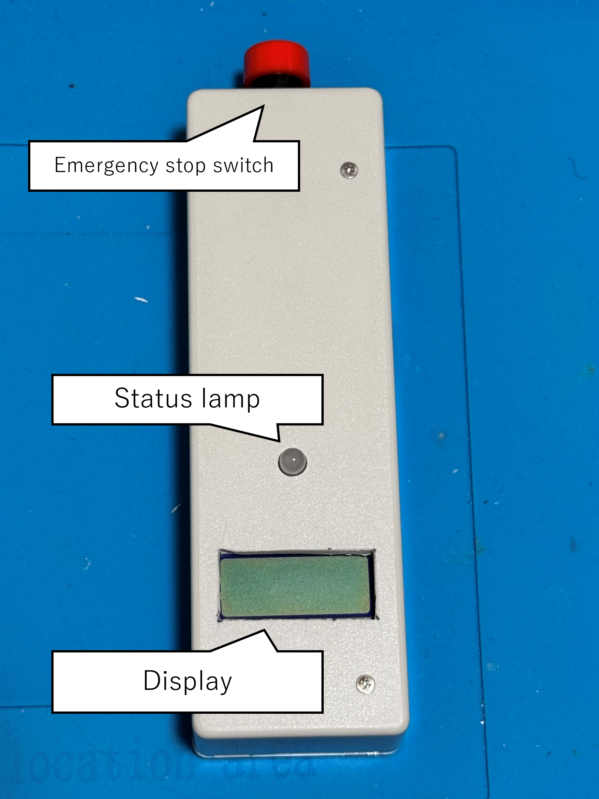
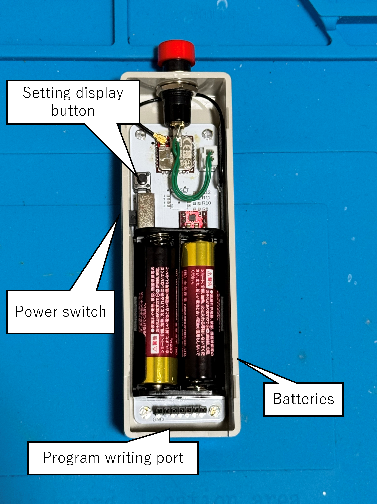
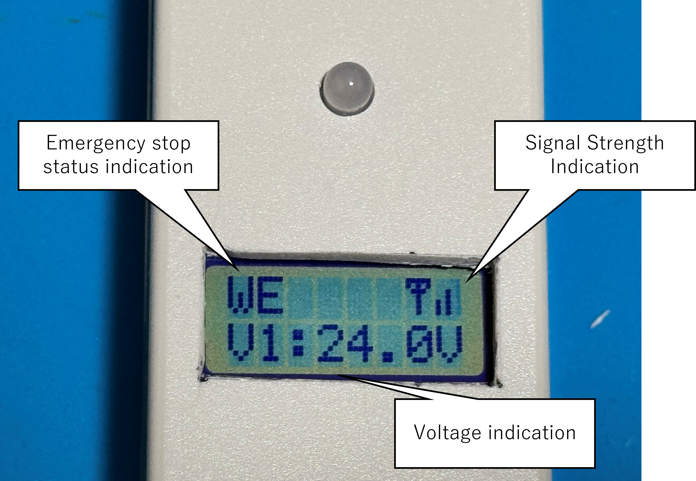

# Wireless_EM_Switch
This is the public data of the wireless switch that controls the [dedicated board](https://github.com/KimuraTomohiro/PowerBoard2025).
The unit is available on [this Booth page](https://kimuratomohiro.booth.pm/items/6996725).
Questions about specifications should be sent to `runs_augury7u[Atto]icloud.com`. (Please replace brackets with @)
This page explains how to use the unit.

## Part Names

## Body

### Display

### Role of each parts
* Emergency stop switch  
Operates and releases the emergency stop.

* Status lamp  
Displays the status of communication establishment with the relay control unit and its own signal transmission information.

* Display  
Displays the operation mode, signal strength, and voltage of the relay control unit.

* Power switch  
Turns on the power. Auto power off is set to 12 hours, but be sure to turn off the power after use.

* Batteries  
The unit is powered by two AA batteries. When using general alkaline batteries, the battery life is calculated to be about 100 hours, assuming constant reception.

* Program writing port  
Connect [TWELITER3](https://mono-wireless.com/jp/products/twelite-r/index.html) to rewrite the program.

* Setting display button  
Displaying the application ID and three channel IDs set in the unit by turning on the power while pressing this button.

## About the status lamp
The status lamp changes color and glows according to the current status.
* Color  
Red: Communication with the relay control unit has not been established  
Green: Communication with the relay control unit has been established  

* Illumination  
Lit: Output state  
Flashing: Emergency stop  
Rapid flashing: Emergency stop is being released.

## How to operate
When power is applied, the status lamp turns red. When a connection with the relay control unit is established, the lamp changes to green and the display shows signal strength and voltage.  
When the emergency stop button is pressed, the status lamp will change from glowing to flashing and an emergency stop signal will be issued. When it is confirmed that the output of the relay control unit has been properly disconnected, WE (Wireless Emergency) appears in the upper left corner of the display.  
If the emergency stop button is pressed and held while the status lamp is flashing, the word `RELEASE` and a progress bar will appear on the screen. If you continue to press and hold the button until the progress bar reaches its maximum, the display will change to `RELEASING...`and the emergency stop status will be released. After the release, the power returns to the power-on state.

## Using multiple units together
This unit can be used in combination with multiple units.
When one switch is operated, all switches enter the emergency stop state. All switches can be released from the emergency stop state.

## About the auto power-off function
The unit is equipped with a 12-hour auto power-off function. When the screen display shows `Sleeping`, the auto power-off function is activated and the power should be turned on again.

## About rewriting the program
To change the channel ID or application ID, [TWELITER3](https://mono-wireless.com/jp/products/twelite-r/index.html) is required.
For details, please refer to [How to rewrite the program](How to rewrite the program.md).

## How to check the application ID and channel
The Application ID and Channel ID of the monitoring system must match in order to communicate with the relay control unit.
This section explains how to check the Application ID and Channel ID of the monitoring system.
1. open the back cover of the monitoring system.
2. Turn off the power with the power switch and turn on the power while holding down the setting display button on the board.
3. While holding down the setting display button, the application ID is shown in the upper row of the display and the three channel IDs are shown in the lower row.